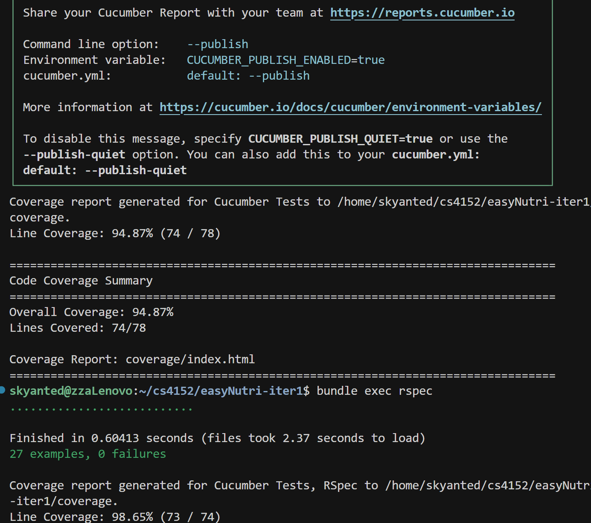
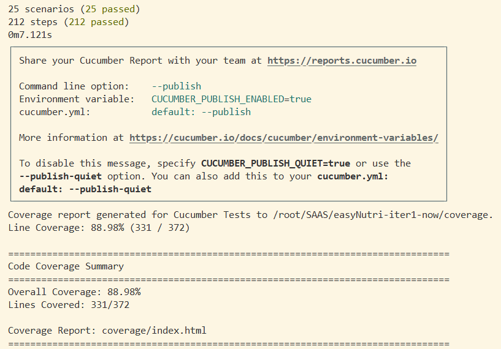
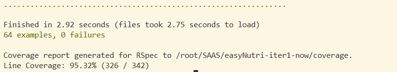
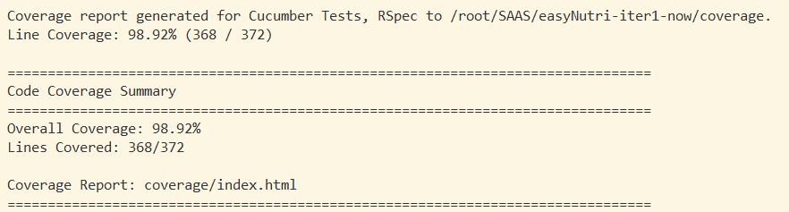

# EasyNutri

### Members:
- Zhengda Li - zl3651
- Qianyi Fan - qf2189
- Zian Zhang - zz3402
- Ying Wang - yw4360

## Here is Our Prototype!!

Heroku Link: https://easynutri2-1337c3134520.herokuapp.com/
## Features

### Main Interface
- **User Management**: Create User and Create Meal Plan buttons are located at the top alongside the EasyNutri title
- **User Selection**: Main interface allows you to select a user from the list
- **Single Active Meal Plan**: Each user now has only one current active meal plan

### Daily Meal Plan View
Once a user is selected, the interface displays:
- Current active meal plan details
- Today's recommended menu at the bottom
- **Next Button**: Navigate to the next day's menu

### Smart Tracking & Recommendations
Before advancing to the next day, a dialog will prompt you to update today's meal plan execution:

**Three tracking options:**
1. **Followed strictly** - Maintained the recommended meal plan
2. **Ate less healthy** - Consumed less healthy foods than recommended
3. **Ate healthier** - Consumed healthier foods than recommended

Based on your selection, the system will optimize and adjust recommendations for the next day and future meals.

##

### Install and Running/Testing

require:
- Ruby 3.2.2
- Rails 7.1.5+
- PostgreSQL 9.3+


### Clone project
```bash
git clone <repository-url>
cd easyNutri-iter2
```

### install dependencies
```bash
bundle install
```

### Install PostgreSQL
Ubuntu/Debian
```bash
sudo apt update
sudo apt install postgresql postgresql-contrib
sudo systemctl start postgresql
sudo systemctl enable postgresql
```
macOS (using Homebrew)
```bash
brew install postgresql@14
brew services start postgresql@14
```
macOS (using MacPorts)
```bash
sudo port install postgresql14-server
sudo port load postgresql14-server
```

### Setup database
```bash
# Create databases
rails db:create
# Run migrations
rails db:migrate
# Load sample food data (required for testing)
rails db:seed
```

Verify installation:
```bash
psql --version
```

### Run app
```bash
bundle exec rails s -b 0.0.0.0
```
`http://localhost:3000`


### Run rspec and cucumber tests

**Important:** Set up test database first:

```bash
# Create and migrate test database
rails db:create RAILS_ENV=test
rails db:migrate RAILS_ENV=test
# Or use the shortcut:
rails db:test:prepare
```

Then run tests:
```bash
bundle exec rspec
bundle exec cucumber
```

**If you get "Migrations are pending" error:**
```bash
rails db:migrate RAILS_ENV=test
```

**If you get database connection errors:**
```bash
# Recreate test database from scratch
rails db:drop RAILS_ENV=test
rails db:create RAILS_ENV=test
rails db:migrate RAILS_ENV=test
```
<!-- Our Testing result for iter 1:
 -->

 **Our Testing result for iter 2:**

 **Cucumber coverage**

 **Rspec coverage**

 **Cucumber and Rspec combined coverage**


## Only if something went wrong

### configue database
Create `.env` file from template:
```bash
cp env.example .env
```

**Note:** Username and password are optional. If your PostgreSQL uses peer authentication (default on Linux/macOS), you don't need to set them. Only configure if your PostgreSQL requires password authentication:

Edit `.env` if needed:
```
DATABASE_USERNAME=postgres  # Optional: only if needed
DATABASE_PASSWORD=          # Optional: leave empty if using peer auth
DATABASE_HOST=localhost
DATABASE_PORT=5432
```

